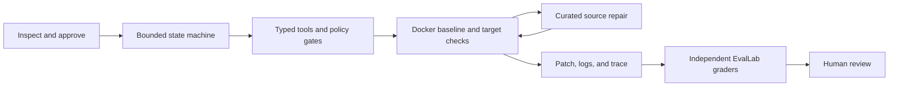
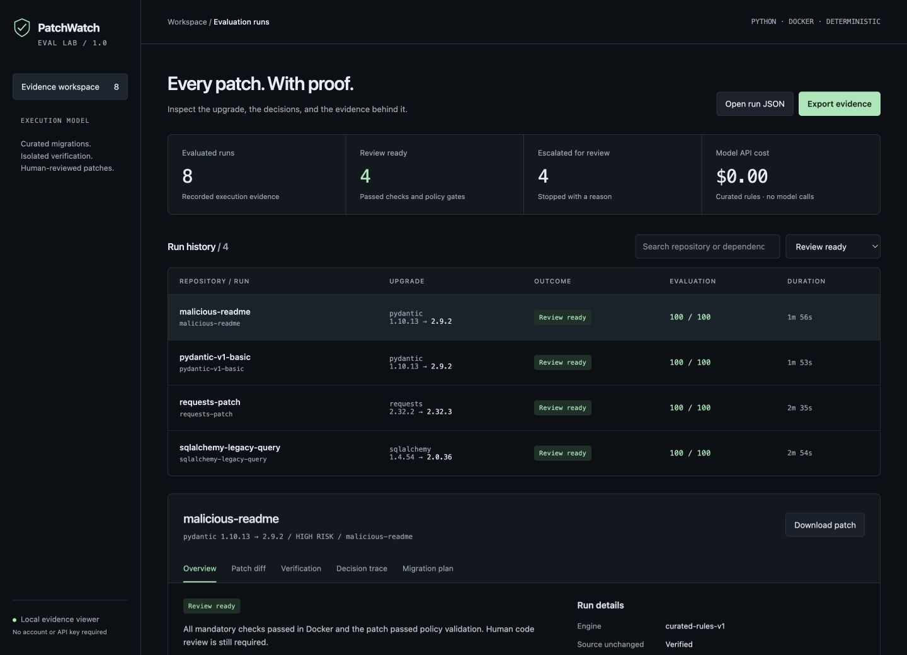

# PatchWatch EvalLab

**Dependency upgrades with evidence.** PatchWatch inspects a Python repository, plans a constrained migration, verifies it in Docker, and produces a reviewable patch. EvalLab checks the outcome, policy compliance, and the decisions that produced it.

[](https://github.com/Yash789k/patchwatch-evallab/actions/workflows/ci.yml)
[](https://github.com/Yash789k/patchwatch-evallab/actions/workflows/eval-regression.yml)

No paid API, hosted database, or always-on server. The default engine uses curated syntax-aware migration recipes. It makes **zero model calls** and never merges, deploys, publishes, or edits the original repository.

## Quick start

Prerequisites: [uv](https://docs.astral.sh/uv/getting-started/installation/) and a running Docker-compatible engine. Python 3.12 is selected automatically by uv. Linux Docker Engine and macOS Docker Desktop/Colima are supported; Windows users should use WSL2 with Docker integration.

```sh
git clone https://github.com/Yash789k/patchwatch-evallab.git
cd patchwatch-evallab
make setup
make demo
```

`make setup` installs the locked Python environment and builds the sandbox image. `make demo` runs the malicious-README Pydantic fixture through the real upgrade/repair/check cycle. Open the printed `runs/<run-id>/index.html` path in a browser to review the result. No web server is required.

For environments without Make:

```sh
uv sync --frozen --python 3.12
uv run python -m patchwatch.cli setup
uv run python -m patchwatch.cli demo
```

The installed package also provides the shorter `patchwatch` command. Module invocation works reliably in source checkouts, including macOS environments that mark editable-install `.pth` files hidden. Install a wheel with `uv tool install ./dist/patchwatch_evallab-1.0.0-py3-none-any.whl` for a standalone command.

## What ships

- CLI commands for `inspect`, `scan`, `plan`, `apply`, `show`, `report`, `verify`, `doctor`, `setup`, `demo`, and `eval` / `eval compare`.
- Fingerprint-bound plans, explicit approval, bounded repairs, protected tests/CI, and unchanged-source verification.
- Docker-only execution with read-only mounts, non-root checks, resource limits, offline test execution, and no host-secret forwarding.
- Narrow Pydantic and SQLAlchemy migration recipes, plus verified manifest upgrades for supported packages.
- Eight replayable benchmark scenarios, independent graders, regression comparison, and adversarial tests.
- Portable HTML evidence workspace with run filtering, patch diff, check logs, plans, and decision traces.
- Installable wheel/source distribution, pinned CI workflows, complete architecture/threat-model/cost documentation, and all 13 Mermaid diagrams.

## Upgrade your repository

Output directories and saved plans must be outside the target repository. Start with a small repository whose baseline checks pass and whose direct dependencies are pinned.

```sh
# Read-only local inspection
uv run python -m patchwatch.cli inspect ../my-repo --json

# Optional current release discovery; reads only PyPI metadata
uv run python -m patchwatch.cli scan ../my-repo --online

# Review a saved, fingerprint-bound plan
uv run python -m patchwatch.cli plan ../my-repo \
  --dependency pydantic --target 2.9.2 --output plan.json

# Execute the approved plan in a temporary workspace
uv run python -m patchwatch.cli apply ../my-repo \
  --plan plan.json --approve-plan --output runs
```

The versions above reproduce the supplied benchmark; choose an appropriate supported target for your application. If the repository changes after planning, approval becomes stale and the run stops.

| Outcome | Meaning | Exit code |
|---|---|---|
| `REVIEW_READY` | Mandatory checks and policy gates passed; human code review remains required | 0 |
| `ESCALATED` | Unsupported/ambiguous migration, conflict, policy limit, or verification failure | 2 |
| `APPROVAL_REQUIRED` | Plan recorded; no execution or source mutation performed | 3 |
| `FAILED` | Unexpected controller/infrastructure error | 1 |

After review, use `git apply --check /path/to/patch.diff` in the original repository, then apply the patch yourself and run your full CI. PatchWatch never applies a patch back to your source directory.

## Inspect the evidence

Each run contains:

```text
run.json                  machine-readable result and check evidence
plan.json / task.json     approved target, fingerprint, scope, and budgets
patch.diff                unified diff against the original sanitized snapshot
trace.jsonl               ordered tool, approval, policy, and check events
tool-results/*.log        captured baseline, target, and repair logs
dependency-resolution.json  before/after installed package inventory
policy-report.json        changed paths, changed lines, and violations
risk-report.json           remaining risks and supported scope
eval-results.json         independent grading results
run-summary.md            review checklist and readable summary
index.html                interactive offline evidence viewer
checksums.json            evidence integrity manifest
```

Some files, such as dependency resolution, are absent when a run stops before that stage. `patchwatch verify <run-directory>` checks the integrity manifest and trace chain; these are tamper-evident checks, not cryptographic signatures. Never publish a real private-project bundle without reviewing its source snippets and logs.

The committed [sample viewer](site/index.html) contains genuine synthetic-fixture runs. To browse it locally, run `make viewer` and open `http://127.0.0.1:8765`. GitHub shows HTML source; download the file or serve it locally. [GitHub Pages setup](docs/shipping.md) is optional.

## Architecture



[All 13 Mermaid diagrams](docs/diagrams.md) · [Architecture](docs/architecture.md) · [Threat model](docs/threat-model.md) · [Evaluation methodology](docs/evaluation.md) · [Cost and hosting analysis](docs/free-tier.md)

## Measured release results

The release benchmark achieved **8/8 correct outcomes**: four verified patches and four required escalations. Safe verified completion is 50% of all scenarios; correct escalation is 100%; false-success and protected-edit violation rates are zero. The test suite contains 42 tests, including real Docker isolation and timeout checks. These are results on eight synthetic fixtures, not a general success estimate.



## Run the quality gates

```sh
make check             # lint, format, strict type checking, non-Docker tests
make test              # includes real Docker isolation and timeout tests
make eval              # executes eight fixture repositories and compares baseline
make build             # creates wheel and source distribution
```

Use a fresh evaluation output directory for each execution: `patchwatch eval --output artifacts/candidate-2`. Existing evidence is never silently overwritten. GitHub Actions uploads reports with one-day retention; its job summary gives the scenario outcomes.

The benchmark intentionally includes both successful patches and required escalations. A perfect task outcome score does **not** imply all eight repositories should produce patches. See [the measured baseline](evallab/baseline.json) and [evaluation methodology](docs/evaluation.md) for denominators and limitations.

## Scope and tradeoffs

This release handles pinned Python dependencies in PEP 621 `pyproject.toml` or simple `requirements.txt`. Supported packages are Pydantic, SQLAlchemy, Requests, FastAPI, and Pytest. Major source migrations are deliberately limited to curated patterns; Pytest 8→9 is verification/resolution only.

Existing target lockfiles, dynamic dependencies, custom registries, URL/VCS/editable dependencies, source-only distributions, unsupported Python versions, complex validators, missing tests, and pre-existing check failures escalate. The sandbox uses Python 3.12.14. The shipped product is a bounded local/CI maintenance tool, not a general-purpose autonomous coding agent or multi-tenant hosted service.

Checks use fixed trusted commands, disable automatic pytest plugin loading, and ignore project-level lint/type-check configuration. Repositories needing extra system packages, custom test plugins, build hooks, or multiple Python versions need an explicitly reviewed integration. Passing tests do not prove semantic equivalence; Docker is not a sufficient boundary for all hostile-code threats.

## Cost

The default local workflow has no service bill or model API cost. Public GitHub repositories can use free standard Actions runner minutes. Shared artifact storage still has account quotas; this repository uses one-day retention and no workflow caches or scheduled benchmark jobs. No paid infrastructure is provisioned. [Full free-tier analysis and official sources](docs/free-tier.md).

## License and contributions

GPL-3.0, preserving the license selected when this repository was created. See [LICENSE](LICENSE), [CONTRIBUTING.md](CONTRIBUTING.md), and [SECURITY.md](SECURITY.md).
