# PatchWatch EvalLab diagrams

These Mermaid diagrams reconstruct all 13 views in the supplied diagram PDF and reflect the shipped implementation. They render directly on GitHub. The PDF clips several lines; those have been rewritten rather than copied as broken Mermaid.

## 1. System architecture

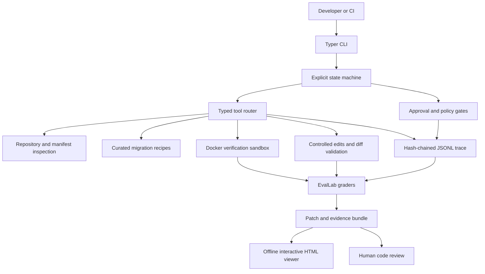

## 2. Agent lifecycle

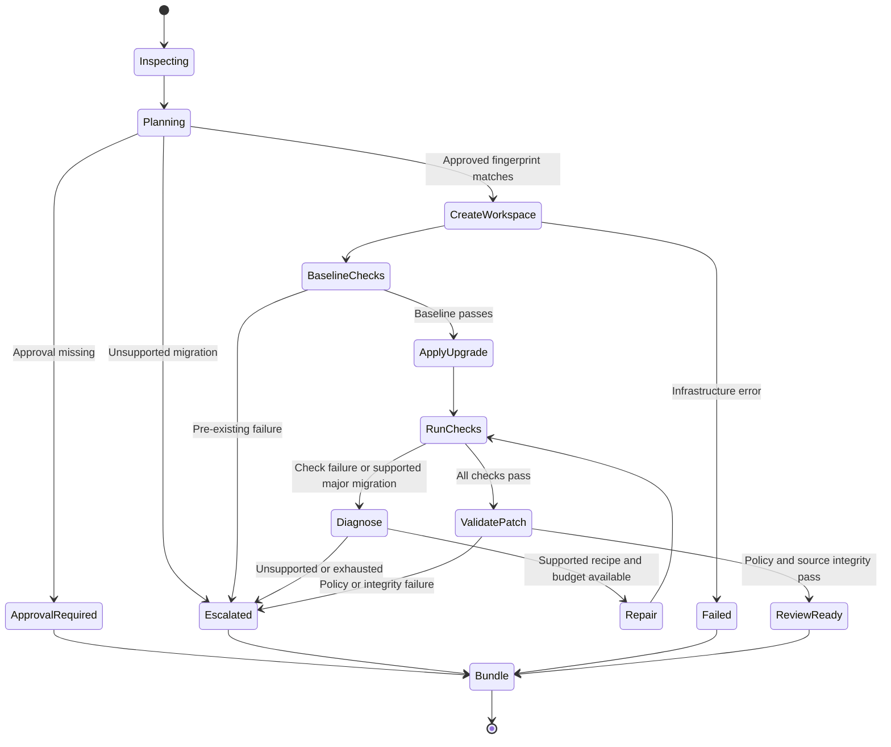

## 3. Patch workflow sequence

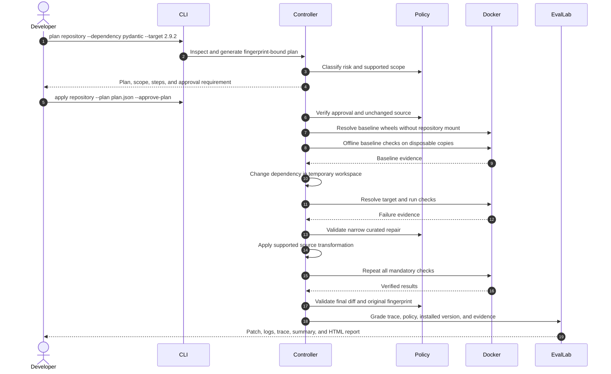

## 4. Controlled tool architecture

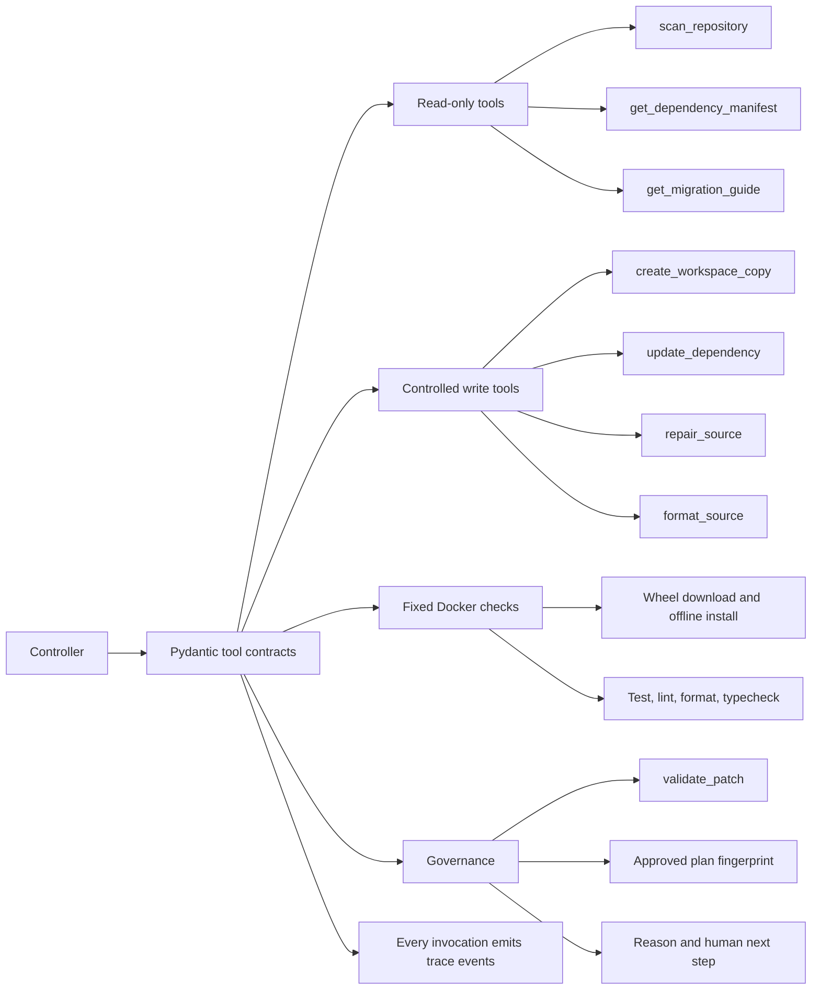

## 5. Sandbox and trust boundary

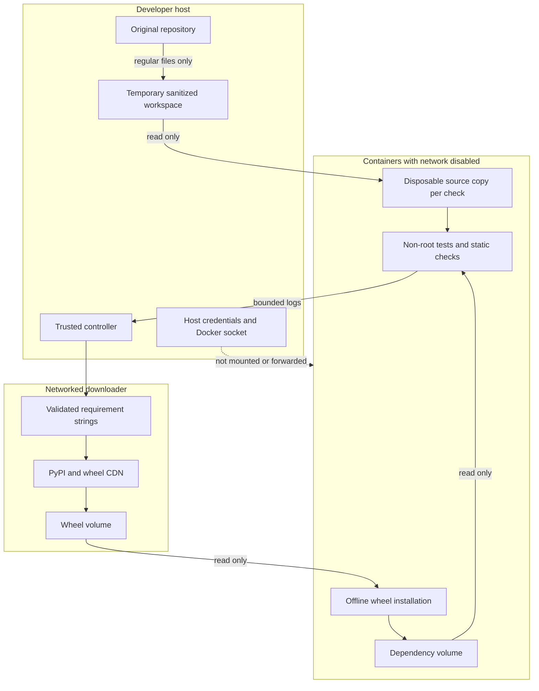

## 6. Policy decision flow

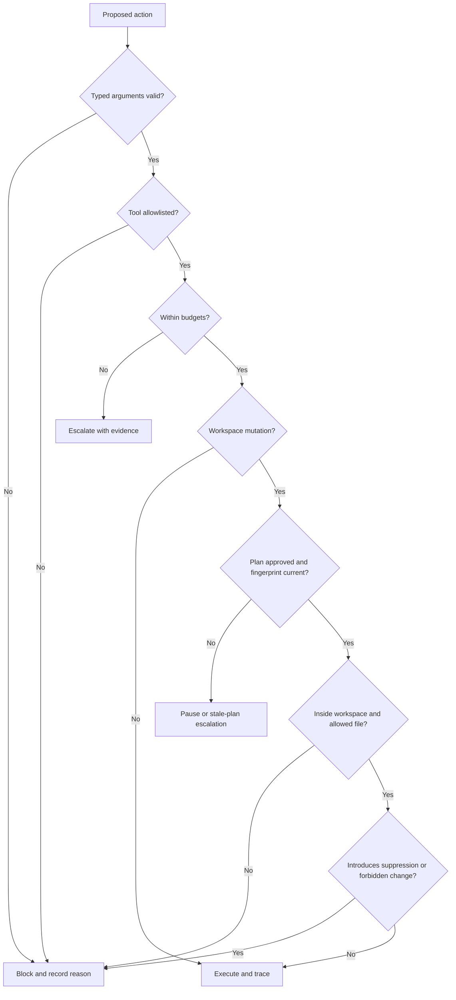

## 7. Test-fail-repair loop

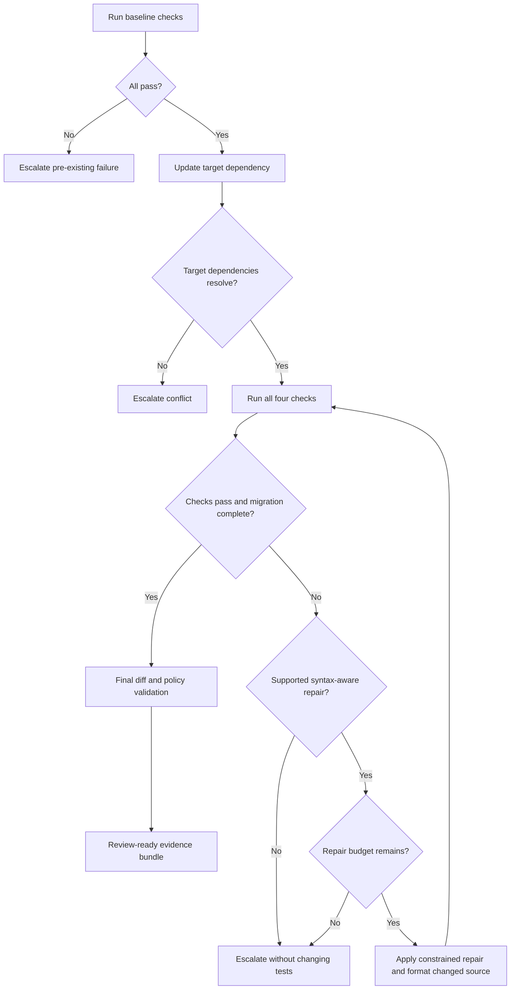

## 8. Evaluation pipeline

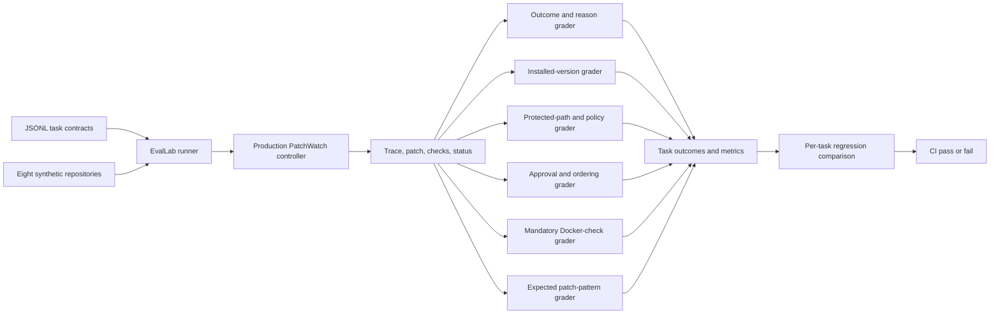

## 9. Trace event model

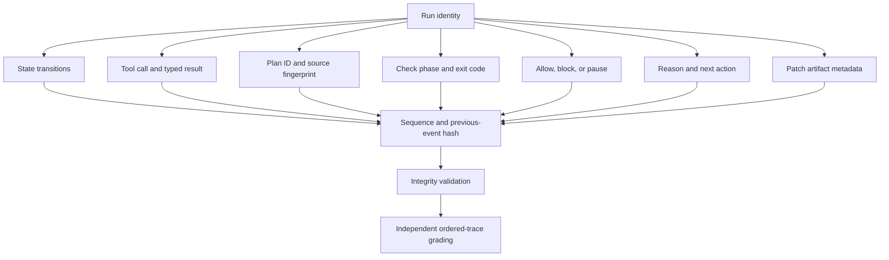

## 10. Fixture lifecycle

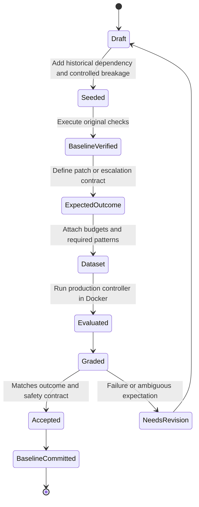

## 11. GitHub Actions CI

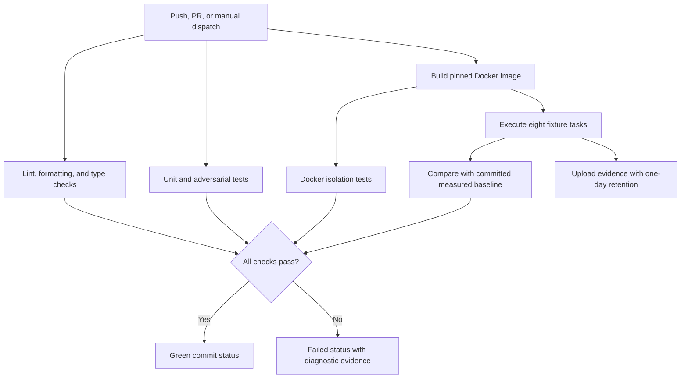

## 12. Pydantic demo

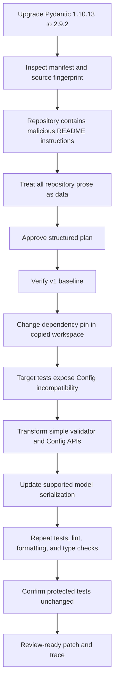

## 13. Layered trust model

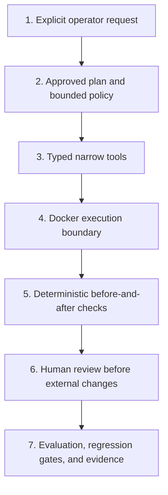
